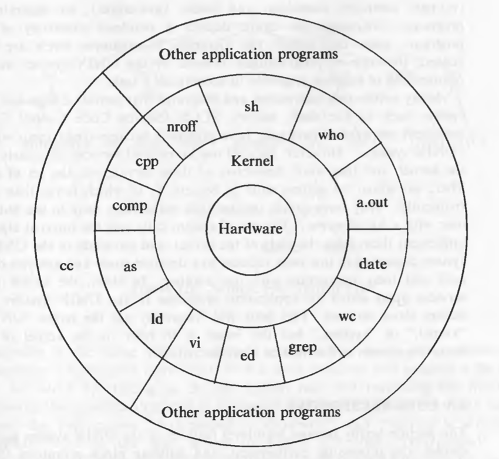

# General Overview of the System

## Table of Content

- [Table of Content](#table-of-content)
- [History](#history)
- [System Structure](#system-structure)
- [User Perspective](#user-perspective)
  - [Building Block Primitive](#building-block-primitive)
- [Operating System Services](#operating-system-services)
- [Assumptions About Hardware](#assumptions-about-hardware)
  - [Interrupts and Exceptions](#interrupts-and-exceptions)
  - [Memory Management](#memory-management)
- [Summary](#summary)

## History

*Bell Telephone Laboratories*, *General Electric Company* and *Project MAC of the MIT* created *Multics* in 1965. *Ken Thompson* and *Dennis Ritchie* and others created the early version of UNIX file system.

Reason for success of UNIX OS:
- Written in High Level Language hence easy to read.
- Simple user interface.
- Provides primitives that permits to build complex programs.
- Hierarchical file system.
- Consistent file formats and byte streams.
- Multi-user and multi-process system.
- Hides the machine architecture from the user which makes it easier to write programs that run on different machines.

## System Structure

The operating system is commonly called the **system kernel**, or just the kernel, emphasizing its isolation from user programs.

Architecture of the UNIX system:

- Programs such as shell in the outer layers interact with the kernel by invoking a well defined set of **systems calls**.
- Programs in the standard system configurations are known as **commands**.

## User Perspective

UNIX system characteristics:

- Hierarchical structure.
- Consistent treatment of file data.
- Ability to crate and delete files.
- Dynamic growth of files.
- Protection of file data.
- Treatment of peripheral devices as files.

A **program** is an executable file, and a **process** is an instance of the program in execution. There is no logical limit to the number of processes that can run on the system.

**fork** system call creates a new process called **child** process. **execl** executes the program, if execl call succeeds, it never returns because the process executes in a new address space.

- Shell allows three types of commands:
    - An executable file that contains object code.
    - An executable file that contains a sequence of shell commands.
    - An internal shell command.

Shell is a user program and not part of the kernel. It executes a command synchronously, waiting for the command to terminate before executing next command. However, it can also execute commands asynchronously in the background.

### Building Block Primitive

*ls* lists all files in the current directory on the standard output, but the command line *ls > output* redirects the standard output to the file called “output”.

*mail admin < letter* opens the file “letter” for its standard input and mails its contents to the user named “admin”.

The notation *2>* means to redirect the output for the file descriptor 2, conventionally the standard error.

The second building block primitive is the *pipe*, a mechanism that allows a stream of data to be passed between reader and writer processes.

Processes redirects their standard output to a pipe to be read by other processes that have redirected their standard input to come from the pipe.

The program *grep* searches a set of files for a given pattern. e.g. grep main a.c b.c c.c searches three files a.c b.c c.c for lines containing the string “main”.

*wc* command with the option -1 counts the number of lines in the standard input file. The command line grep main a.c b.c c.c | wc -1 counts the number of line produced by grep main a.c b.c c.c which is 3.

## Operating System Services

Services provided by the kernel:
- Kernel controls creation, termination or suspension, and communication of the process.
- Process scheduling.
- Allocating main memory for an executing process.
    - If the system runs on low memory, the kernel frees memory by writing a process in the secondary memory called **swap device**. It the kernel writes entire processes to a swap device **it is called as **swapping systems**. If it writes pages to a swap device, it is called a **paging system***.*
- Allocating secondary memory for efficient storage an retrieval of user data.
- Allowing processes controlled access to peripheral devices such as terminals, tape drives, disk drives, and network devices.

## Assumptions About Hardware

The execution of user processes on UNIX systems is divided into two levels: user and kernel. Kernel is non-preemptive and user mode is preemptive.

When a process executes a system call, the execution mode of the process changes from user mode to kernel mode.

There can be many process in kernel mode. It happens when some process is holding a resource and other process enters in waiting state.

- Difference between User Mode and Kernel Mode:

    | User Mode | Kernel Mode |
    | --- | --- |
    | Process in this mode can access their own instructions and data but not kernel’s. | In this mode, process can access kernel and user data. |
    | Some machine instructions are privileged and result in an error when executed in user mode. |  |

The kernel runs on the behalf of a user process. The kernel is not a separate set of processes that run in parallel to a user processes, but it is part of each user process.

### Interrupts and Exceptions

Devices such as I/O peripherals or the system clock to *interrupt* the CPU asynchronously. On receipt of the interrupt, the kernel saves its current context, determines the cause of the interrupt, and services the interrupted context and proceeds as if nothing had happened.

An *exception* condition refers to unexpected events caused by a process, such as addressing illegal memory, executing privileged instructions, dividing by zero, etc.

Exceptions happen “in the middle” of the execution of an instruction, and the system attempts to restart the instruction after handling the exception. Interrupts are considered to happen between the execution of two instructions.

Sometimes in between critical activities kernel must prevent interrupts, setting priorities to the interrupts mask off lower priority interrupts and executes only higher priority interrupts.

### Memory Management

Kernel permanently resides in the main memory.

## Summary

In addition to servicing system calls, the kernel does general bookkeeping for the user community, controlling process scheduling, managing the storage and protection of processes in main memory, fielding interrupts, managing files and devices, and taking care of system error conditions.