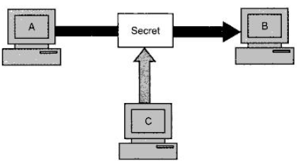

# Introduction to The Concepts of Network Security

## Table of Contents

- [Table of Contents](#table-of-contents)
- [Modern Nature of Attacks](#modern-nature-of-attacks)
- [Security Approaches](#security-approaches)
  - [Security Models](#security-models)
- [Principles of Security](#principles-of-security)
  - [Confidentiality](#confidentiality)
  - [Authentication](#authentication)
  - [Integrity](#integrity)
  - [Non-repudiation](#non-repudiation)
  - [Access Control](#access-control)
  - [Availability](#availability)
  - [Ethical and Legal Issues](#ethical-and-legal-issues)
- [Types of Attacks](#types-of-attacks)
  - [General View](#general-view)
  - [Technical View](#technical-view)
  - [Practical View](#practical-view)
  - [Programs that Attack](#programs-that-attack)
  - [Specific Attacks](#specific-attacks)

## Modern Nature of Attacks

1. **Automating Attacks**: Humans dislike mundane and repetitive tasks. Automating them can cause financial destruction or a security nuisance quite rapidly.
2. **Privacy Concerns**: Companies collect, collate, polish and format all sorts of data and are willing to give this information to whoever pays highest. This can lead serious privacy concerns for common people.
3. **Distance Does Not Matter**: Attacker can perform security attacks from their home, in this modern era distance does not matter.

## Security Approaches

A **trusted system** is a computer system that can be trusted to a specified extent to enforce a specified security policy. A trusted system should be:
- Tamper proof.
- Always be invoked.
- Small enough so that it can be tested independently.

**Bell-LaPadula Model** is a model in which a highly trustworthy computer system is designed as a collection of objects and subjects. Objects are passive repositories or destinations for data, such as files, disks, printers, etc. Subjects are active entities, such as users, processes, or threads operating on behalf of those users.

### Security Models

1. **No Security**: The approach could be a decision to implement no security at all.
2. **Security through Obscurity**: A system is secure simply because nobody knows about its existence and contents. This approach doesn’t work for too long.
3. **Host Security**: The security for each host is enforced individually. This is a very safe approach, but it cannot scale well.
4. **Network Security**: The focus is to control network access to various hosts and their services, rather than individual host security. This is a very efficient and scalable model.

## Principles of Security

### Confidentiality

It specifies that only the sender and the intended recipient should be able to access the contents of a message. Confidentiality gets compromised if an unauthorized person is able to access a message.

If the message is accessed by C without the permission or knowledge of A and B. This type of attack is called **interception**.

### Authentication

Authentication mechanisms help establish proof of identities. The authentication process ensures that the origin of an electronic message or document is correctly identified.

If C pretends to be A and sends some message to B than this type of attack is known as **fabrication**.

### Integrity

If the contents of the message is as it is when it reaches the receivers than we say that the integrity of the message is not lost.

If the message is change by C before it reaches to B than this type of attack is called as **modification**.

### Non-repudiation

A sends some message to B and later on denies it, this is called as repudiation. Non-repudiation defeats such purpose.

### Access Control

It specifies and controls **who** can access **what**. It is broadly related to two areas: *role management*(which user can access what) and *rule management*(which resources is available under what circumstances).

An *Access Control Matrix*(ACM) is prepared to give access, an *Access Control List*(ACL) is a subset of ACM.

### Availability

A given resources should available to the authorized party at all the time. If another unauthorized party is accessing a resource which is required by an authorized party than this attack is called as **interruption**.

---

| OSI NETWORK MODEL 7498-1 | OSI NETWORK MODEL 7498-2 |
| :----------------------: | :----------------------: |
|    APPLICATION LAYER     |      AUTHENTICATION      |
|    PRESENTATION LAYER    |      ACCESS CONTROL      |
|      SESSION LAYER       |     NON-REPUDIATION      |
|     TRANSPORT LAYER      |      DATA INTEGRITY      |
|      NETWORK LAYER       |     CONFIDENTIALITY      |
|     DATA LINK LAYER      |       AVAILABILITY       |
|      PHYSICAL LAYER      |       NOTARIZATION       |

---

### Ethical and Legal Issues

The ethical issues in security systems are classified into four categories:

1. Privacy: This deals with the right of an individual to control personal information.
2. Accuracy: This deal with authenticity, fidelity, and accuracy of information.
3. Property: Here, we find the owner of the information. It also deals with access control.
4. Accessibility: Deals with the issue of what information does an organization have the right to collect.

## Types of Attacks

### General View

1. Criminal Attacks: Attacker attack to maximize financial gains. These attacks consists of Fraud, Scams, Identity Theft, Brand Theft, etc.
2. Publicity Attacks: These attacks happen if someone wants to adopt a famous name or someone wants to defame a famous name.
3. Legal Attacks: Here, attacker manipulates government bodies to gain something, their aim is to exploit the weakness of the judge and jury in technological matters.

### Technical View

Attacks are generally classified into four categories i.e. Interception, Fabrication, Modification, and Interruption. Attacks can be further classified into two categories i.e. Passive Attacks and Active Attacks.

1. **Passive Attack**: These do not involve any modifications to the contents of an original message, instead it consists of eavesdropping or monitoring of data which is in transmission. These attacks are harder to detect.

2. **Active Attack**: Here, the contents of the original message are modified in some way.

   

   - Trying to pose as another entity involves **masquerade** attacks.
   - Modification attacks can be classified further into **replay attacks** and **alteration of messages**.
   - Fabrication cause **Denial Of Service (DOS)** attacks.

### Practical View

1. Application-level Attacks: Here, attacker tries to access, modify, or prevent access to information of a particular application.
2. Network-level Attacks: These attacks make an attempt to either slow down, or completely bring to halt, a computer network. These can automatically lead to application-level attacks.

### Programs that Attack

1. **Virus**: It is a computer program that attaches itself to another legitimate program, and causes damage to the computer system or to the network. It does it by *modifying* program.

   Lifecycle of a virus:

   1. Dormant Phase: Virus is idle, it gets activated by certain action or event.
   2. Propagation Phase: Virus starts copying itself and thus propagating.
   3. Triggering Phase: When action is triggered the virus moves to this phase.
   4. Execution Phase: Here, the virus does it actual work.

2. **Worm**: A worm does not perform any destructive actions, and instead, only consumes system resources to bring it down. It does it by *replicating* itself again and again.

3. **Trojan Horse**: It allows the attacker to obtain some confidential information about a computer or a network. It does it by silently sticking itself to a program.

### Specific Attacks

1. **Sniffing and Spoofing**: A packet consist of data and addressing information that is sent over the internet to a receiver, attackers target these packets as they travel from source to destination.
   1. **Packet Sniffing**: It is a passive attack where attacker only observe the packets.
   2. **Packet Spoofing**: Here, the attacker sends packets with an incorrect source address. When this happens, the receiver would inadvertently send replies back to this forged address.
2. **Phishing**: This attack attempts to fool legitimate users to provide their confidential information to fake sites.
3. **DNS Spoofing/DNS poisoning/Pharming**: This attack changes the DNS entries so that users are redirected to a different site, while they think that they are connected to the real site.
